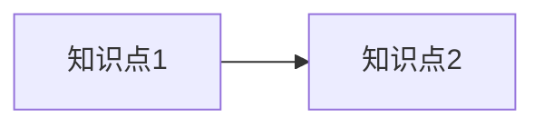

<%*
const now = moment();
const topic = await tp.system.prompt("学习主题", "Java 多线程");
const category = await tp.system.suggester(["后端", "前端", "数据库", "工具"], ["后端", "前端", "数据库", "工具"]);
const difficulty = await tp.system.suggester(["简单", "中等", "困难"], ["简单", "中等", "困难"]);

const fileName = `学习笔记-${topic.replace(/\//g, "-")}-${now.format("YYYYMMDD")}.md`;
const folder = "04 学习成长";
if (!app.vault.getAbstractFileByPath(folder)) await app.vault.createFolder(folder);
const fullPath = `${folder}/${fileName}`;

if (app.vault.getAbstractFileByPath(fullPath)) { 
  new Notice("⚠️ 笔记已存在！"); 
  return; 
}
%>
---
title: 学习笔记 - <%* tR += topic %>
date: <%* tR += now.format("YYYY-MM-DD HH:mm:ss") %>
分类: <%* tR += category %>
难度: <%* tR += difficulty %>
tags: [学习笔记, <%* tR += category %>, <%* tR += topic %>]
---

# 学习笔记：<%* tR += topic %>
## 一、学习目标
- 掌握：
- 了解：

## 二、核心知识点
### 1. 概念定义
- 
- 

### 2. 原理/流程


### 3 . 代码示例

```java
// 这里写代码示例

```