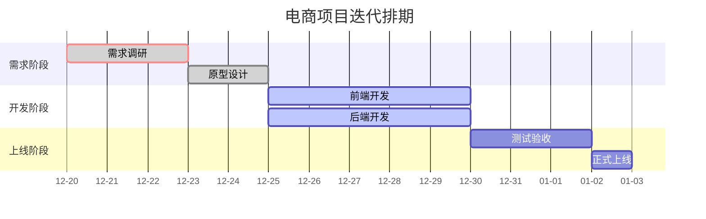

##  核心语法结构

Mermaid Gantt是Typora内置的甘特图工具，核心用于展示**任务时长、进度状态、依赖关系**，语法由**配置项**和**任务项**组成：

| 语法模块      | 说明                                                         |
| ------------- | ------------------------------------------------------------ |
| `title`       | 定义甘特图标题（可选）                                       |
| `dateFormat`  | 设置日期格式（如`YYYY-MM-DD`，必填）                         |
| `axisFormat`  | 自定义横轴日期显示格式（如`%m-%d`，可选）                    |
| `section`     | 任务分组（自动配色区分不同阶段，可选）                       |
| 任务状态/标识 | 标注任务状态（`done`已完成/`active`进行中/`crit`关键路径）+ 任务标识 + 时间/时长 |
| `after 标识`  | 定义任务依赖（表示某任务需在前置任务完成后开始）             |

## Typora使用示例

**渲染效果**：会生成带时间轴的甘特图，不同section用不同颜色区分，任务按状态显示为灰色（已完成）、蓝色（进行中）、白色（待开始）。

**红色竖线是今天/当前日期参考线，它能**：

✅ 直观显示时间进度

✅ 帮助评估项目状态

✅ 支持自定义日期和样式

如果你需要制作项目进度报告，合理使用today线会让图表更加专业清晰！

❓ **常见问题**

**Q: 为什么我的图没有红色竖线？**
A: 可能原因：

1. 日期范围太短，today线在边缘
2. 使用了`todayMarker off`
3. Mermaid版本问题
