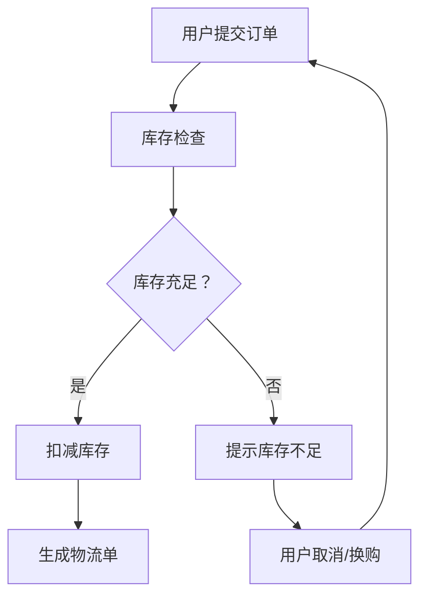
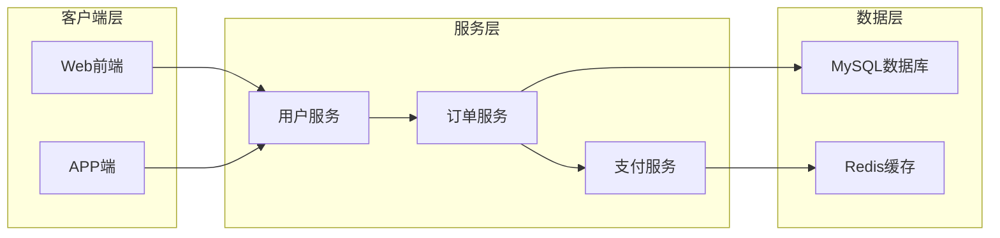
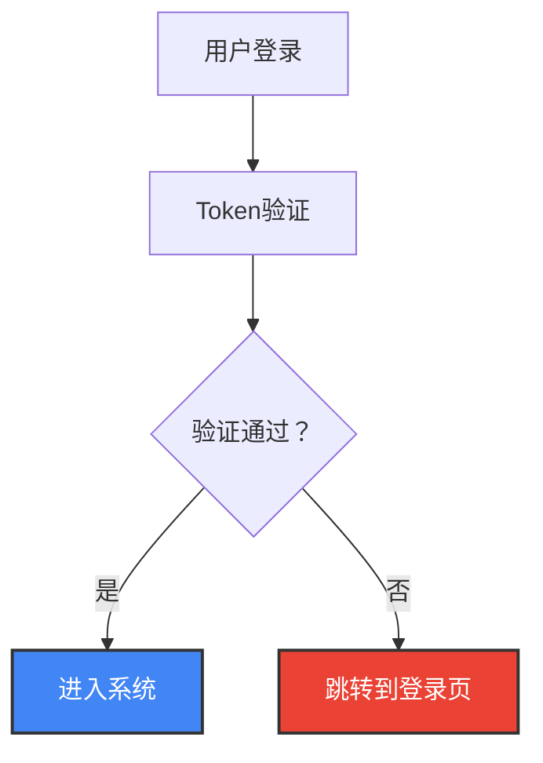
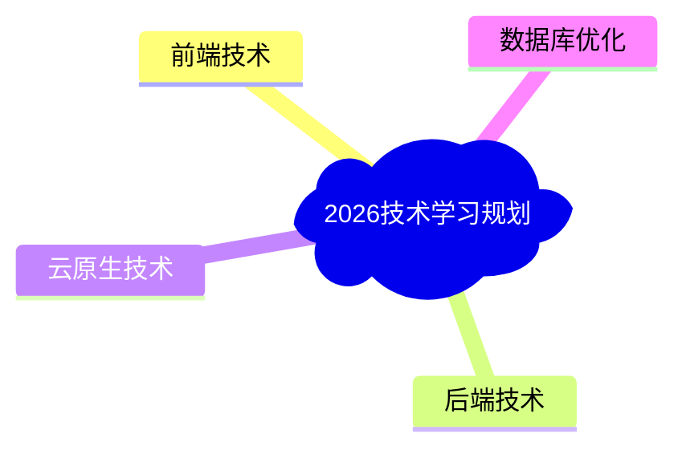
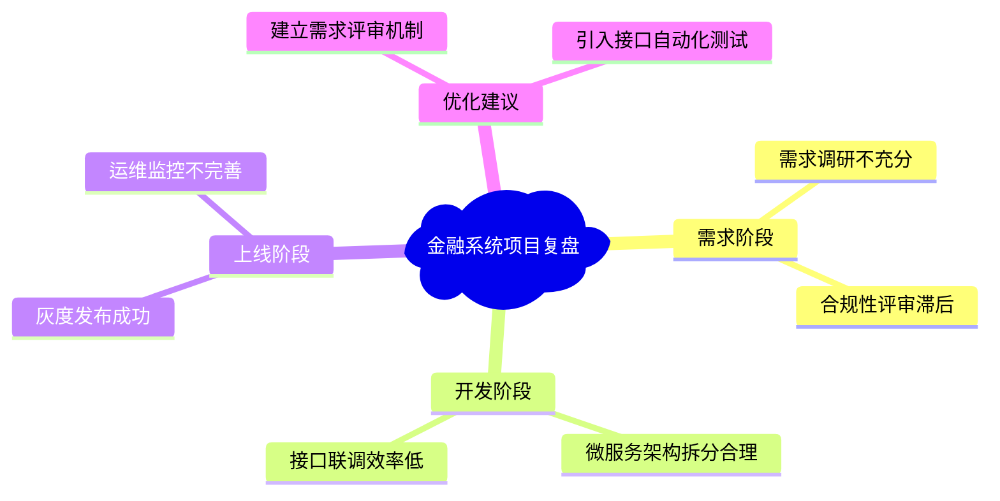
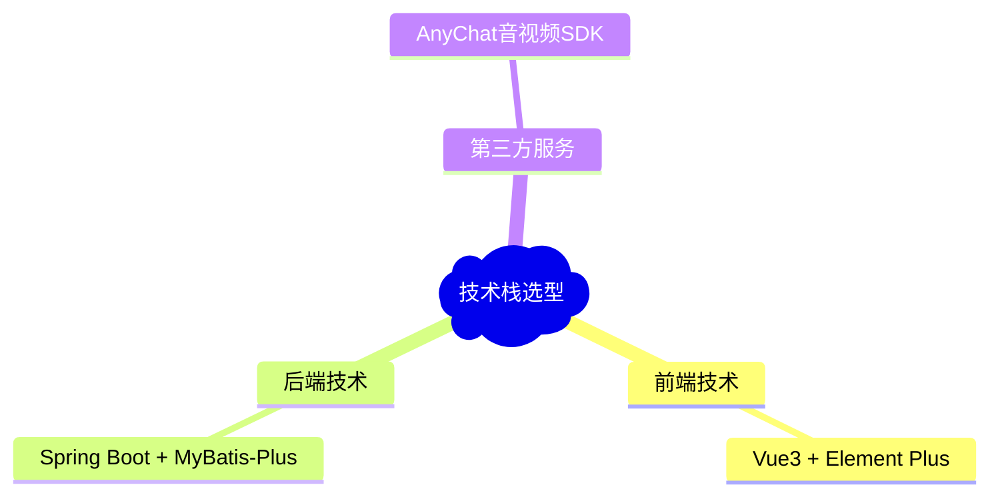

Mermaid 生态中，**Graph（流程图）** 和 **Mindmap（思维导图）** 是 Typora 内置的两大核心可视化工具，二者语法同源、操作互通，常结合用于文档的结构化呈现。以下补充 **Mindmap 思维导图**的语法与示例，并完善 Graph 流程图的全场景用法，所有示例均可直接复制到 Typora 渲染。

## 核心语法体系（Graph + Mindmap）

Mermaid Graph 和 Mindmap 共享基础语法逻辑，区别在于**布局声明**和**节点层级定义**，具体对比如下：

| 语法模块        | Mermaid Graph（流程图）                                  | Mermaid Mindmap（思维导图）                         |
| --------------- | -------------------------------------------------------- | --------------------------------------------------- |
| **布局声明**    | 以 `graph` 开头 + 方向关键字（`LR` 左到右、`TD` 上到下） | 以 `mindmap` 开头，默认**放射状布局**，支持层级缩进 |
| **节点定义**    | 基础：`A[文本]`；条件：`A{文本}`；圆形：`A(文本)`        | 根节点：`root)标题(`；子节点：**缩进**区分层级      |
| **连线/层级**   | 用 `-->` 定义节点流向，支持带标注连线                    | 用**缩进**定义父子层级，无需手动连线                |
| **进阶功能**    | 支持 `subgraph` 子图、`style` 样式自定义                 | 支持节点折叠/展开、样式定制、多分支拓展             |
| **Typora 支持** | 全版本原生支持，无需配置                                 | 需 Typora ≥ 1.12.1 版本，开启「扩展语法-图表」      |

## 二、Mermaid Graph 流程图 全场景示例

### 基础线性流程（无分支）

**语法要点**：布局声明 + 节点 + 基础连线，适合展示步骤型流程。


**渲染效果**：线性排列的矩形节点，箭头连接流程顺序，Typora 自动适配文档宽度。

### 分支判断流程（带循环）

**语法要点**：用 `{}` 定义菱形条件节点，连线标注分支方向（是/否），支持循环跳转。



### 子图分组流程（模块化）

**语法要点**：用 `subgraph` 包裹同类节点，实现流程分组，提升复杂流程图可读性。



**渲染效果**：三个子图分别带边框和标题，节点间连线跨子图关联，层级清晰。

### 4. 样式自定义流程（突出关键节点）

**语法要点**：用 `style` 命令设置节点背景色、字体色、边框样式，适合标注核心/异常步骤。



## Mermaid Mindmap 思维导图 全场景示例

Mermaid Mindmap 是 Typora 1.12.1 及以上版本新增功能，专为**知识梳理、计划规划、内容大纲**设计，语法极简且可视化效果好。

### 基础思维导图（单层级）

**语法要点**：`mindmap` 声明 + 根节点 + 缩进子节点，子节点前可加 `-` 或直接缩进。



**渲染效果**：根节点居中，4 个子节点环绕分布，点击节点可折叠/展开。

### 多层级思维导图（带子分支）

**语法要点**：通过**多级缩进**定义父子层级，支持无限拓展分支，适合详细规划。



**渲染效果**：二级节点（如需求阶段）下挂载三级节点（如需求调研不充分），层级分明，适合项目复盘文档。

### 思维导图 + 流程图 联动示例

在同一篇 Typora 文档中，可同时用 Graph 和 Mindmap 呈现“流程+大纲”，提升文档完整性。


## 技术栈大纲（Mindmap思维导图）



##  Typora 使用关键注意事项

1. **版本要求**：Mindmap 仅支持 Typora ≥ 1.12.1，Graph 全版本支持；
2. **渲染触发**：代码块需标注 ` ```mermaid`，粘贴后 Typora 自动渲染，未渲染可点击右上角「渲染 Mermaid 图表」；
3. **缩进规范**：Mindmap 的层级依赖缩进，建议用 **2 个空格**或 **1 个 Tab** 缩进，避免层级混乱；
4. **导出支持**：渲染后的图表可随文档导出为 PDF、HTML、图片，样式保持不变；
5. **语法容错**：Mermaid 语法容错性高，少写个别标点不影响渲染，但建议保持规范以避免异常。

需要我帮你定制一份**金融项目专属的 Graph 流程图 + Mindmap 思维导图**组合文档吗？