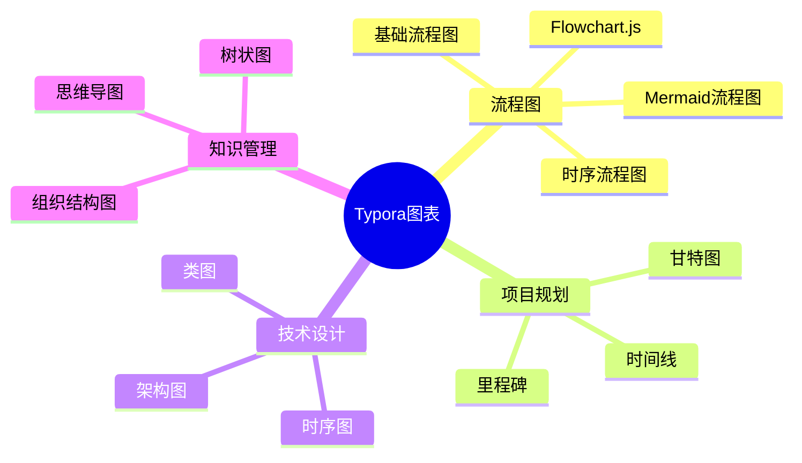
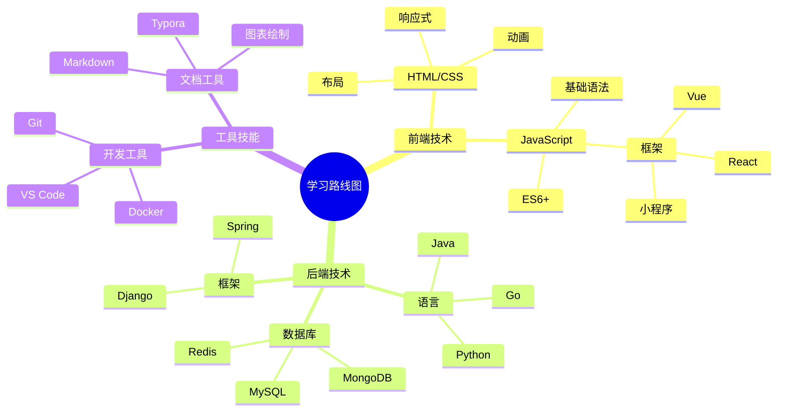
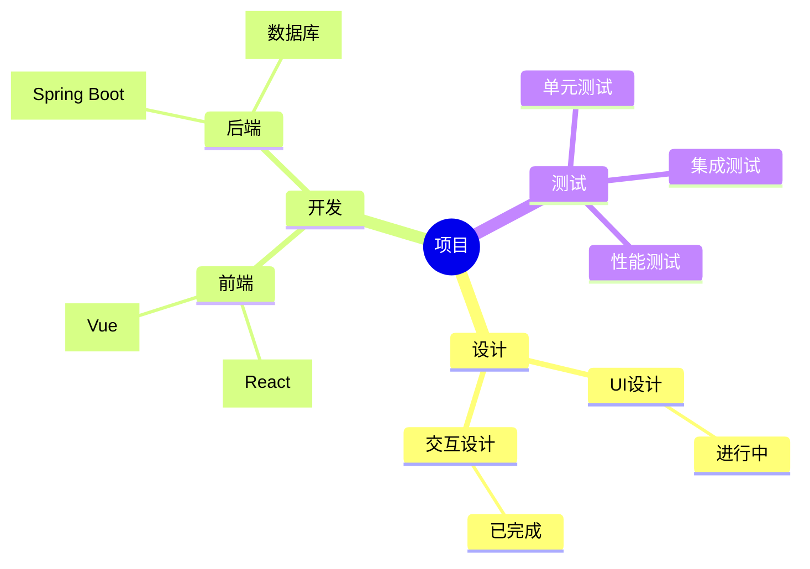

> 版本要求：Typora ≥ v1.12.1

## 基础语法

## 完整示例

## 进阶功能

##  🎯 使用建议

### 按场景选择

1. **项目排期** → **Mermaid Gantt**
2. **系统设计** → **PlantUML**
3. **简单流程** → **Flowchart.js**
4. **知识梳理** → **Mermaid Mindmap**

### 按技术偏好

- **新手友好**：Flowchart.js > Mermaid Mindmap > Mermaid Gantt > PlantUML
- **功能强大**：PlantUML > Mermaid系列 > Flowchart.js
- **兼容性好**：Mermaid系列 > Flowchart.js > PlantUML