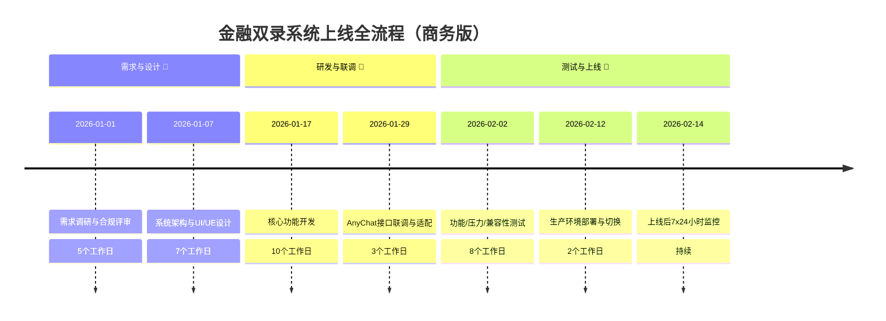
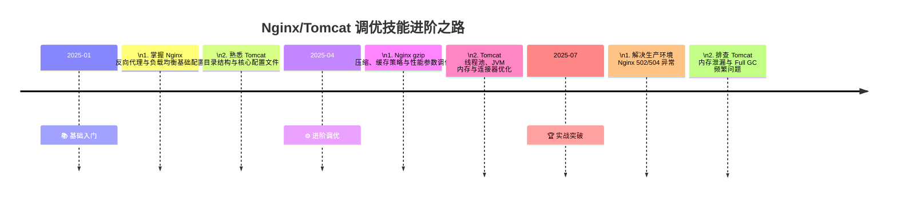
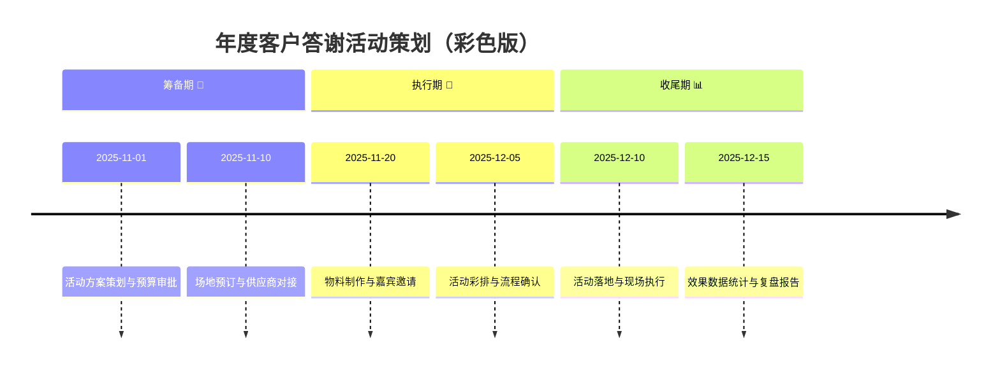
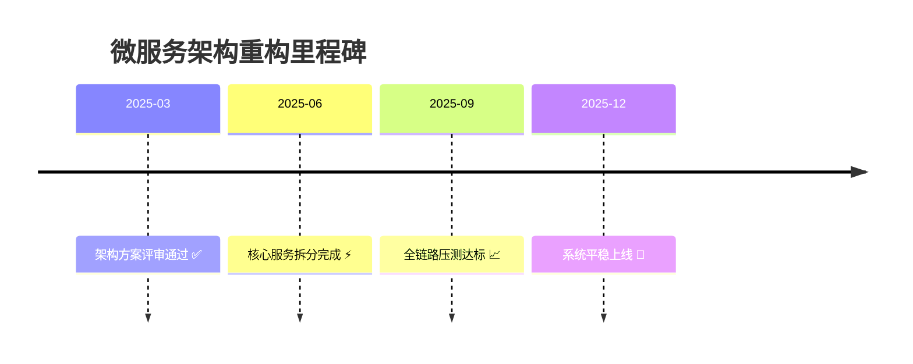

里为你整理了4类在 Typora 中可直接渲染的精美 Mermaid Timeline 示例，包含多色分段、图标点缀、项目里程碑、个人成长等场景，适配不同文档风格，直接复制代码块即可使用。

---

## 示例1：商务风多色分段项目时间线（适合汇报）

用 section 分组并自动配色，清晰区分阶段，搭配时长标注，专业感拉满。

## 示例2：技术成长时间线（带换行与技能分层）

用 `\n` 强制换行，序号清晰，适配技术学习/技能梳理场景，阅读无压力。

## 示例3：彩色主题营销活动时间线（视觉吸睛）

通过 section 配色区分模块，搭配 emoji 与简短描述，适合活动策划/运营复盘。

## 示例4：简约里程碑时间线（极简风）

无冗余格式，突出关键节点，适合文档摘要、会议纪要等场景。

---

## 精美好用的核心技巧

1.  **配色与分组**：用 section 划分模块，Mermaid 会自动分配不同颜色，最多支持 12 种差异化配色。
2.  **换行与排版**：子任务用 `\n` 强制换行，单个描述控制在 20-30 字，避免横向溢出。
3.  **图标点缀**：添加 emoji（📝/🔧/🚀 等）提升可读性，适配 Typora 亮/暗主题。
4.  **版本与设置**：Typora 需 ≥1.12.1，在「设置→Markdown→扩展语法」中勾选「图表」。

需要我把你指定的**项目内容**改成上述任意一种风格的 timeline 吗？也可以按你的**主题色/模块划分**定制专属配色与排版。