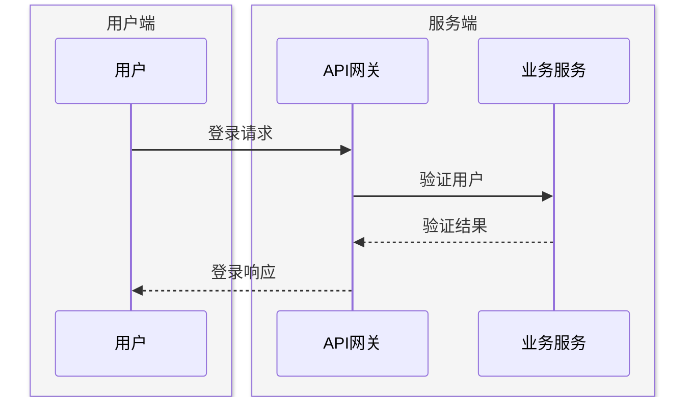

## 🔧 实用技巧

### 消息分组



**常用美观的内置颜色名**：

- 浅色系：`lightgray`、`lightblue`、`lightgreen`、`lightyellow`、`lavender`、`mistyrose`
- 中性系：`gainsboro`、`whitesmoke`、`beige`、`honeydew`
- 清新系：`palegreen`、`paleturquoise`、`powderblue`、`skyblue`

### 网页示例

```html
<!DOCTYPE html>
<html>
<body>
  <script src="https://cdn.jsdelivr.net/npm/mermaid/dist/mermaid.min.js"></script>
  <div class="mermaid">
sequenceDiagram
    Alice->>John: Hello John!
    John-->>Alice: Hi Alice!
  </div>
</body>
</html>
```

## 💡 最佳实践建议

1. **命名清晰**：使用有意义的参与者名称
2. **避免过长**：复杂流程拆分为多个图
3. **合理使用激活**：显示控制流时很有用
4. **颜色分组**：用颜色区分不同模块
5. **消息简洁**：消息文本要简明扼要

## 🎯 实际应用场景

| 场景         | 推荐用法                |
| ------------ | ----------------------- |
| API调用流程  | 同步/异步消息，错误处理 |
| 用户登录流程 | 条件判断(alt/else)      |
| 并发操作     | 并行处理(par)           |
| 状态流转     | 循环(loop)，激活框      |

如果你有特定的使用场景，我可以帮你设计更针对性的序列图结构。

