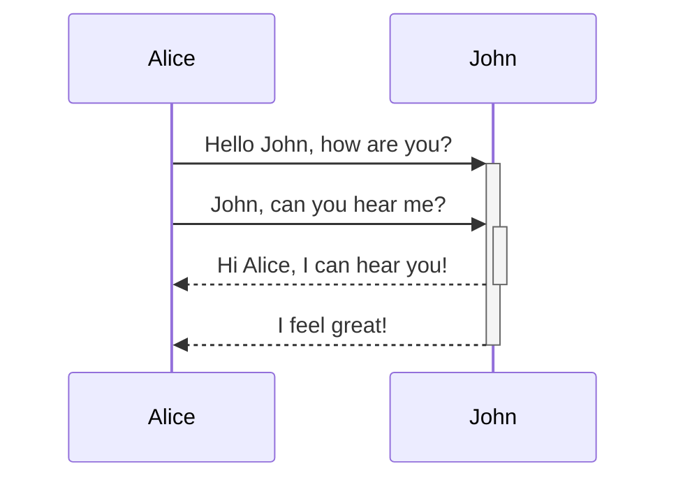
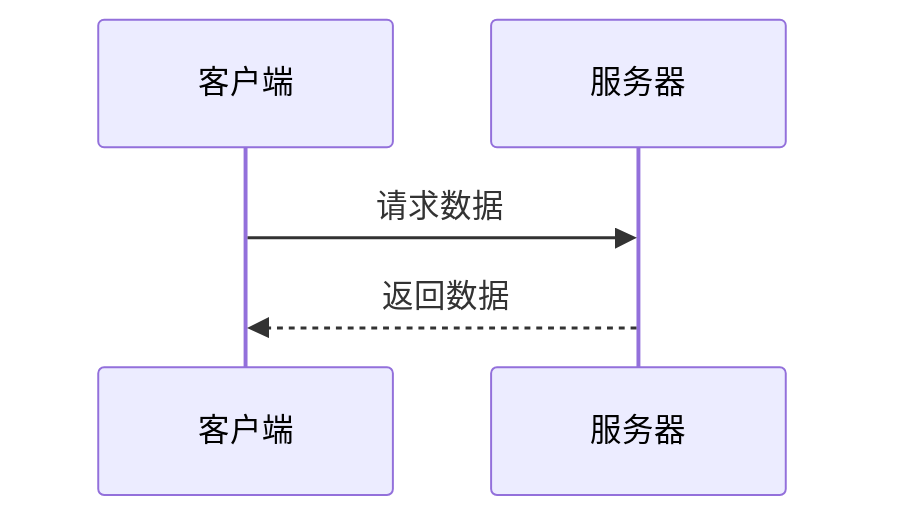
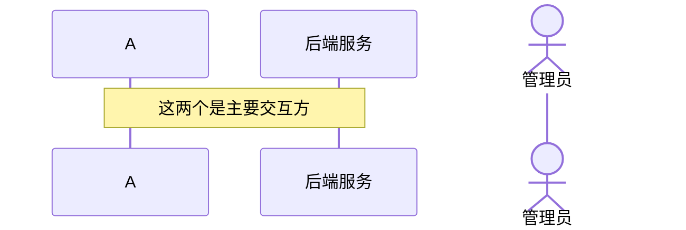
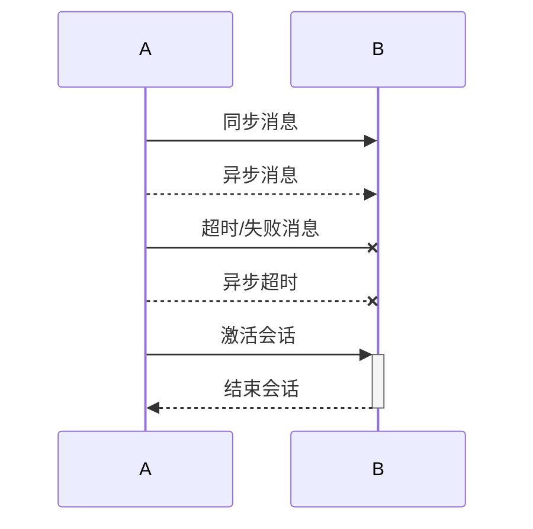
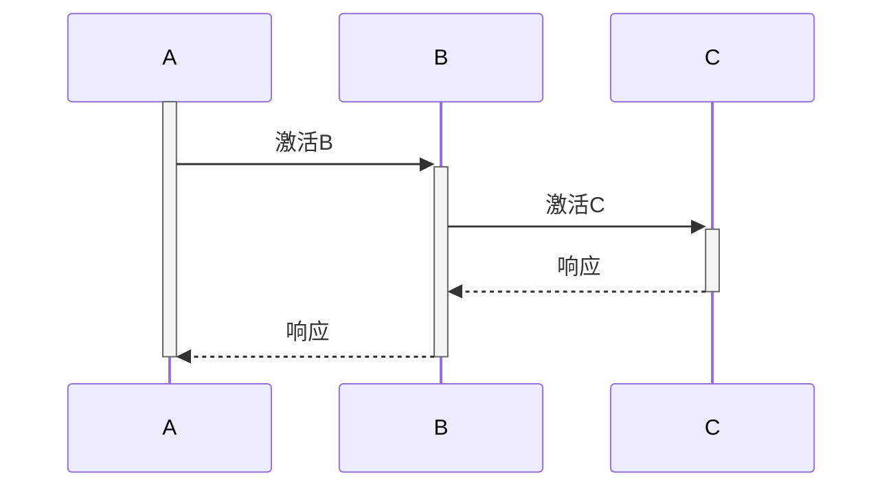
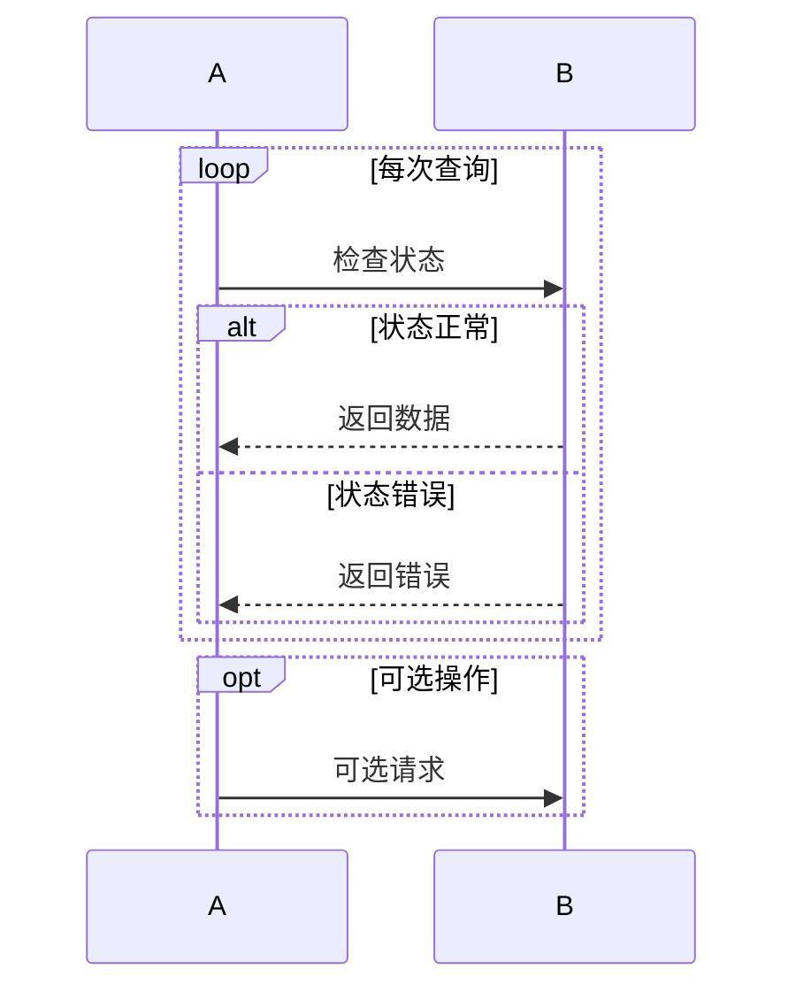
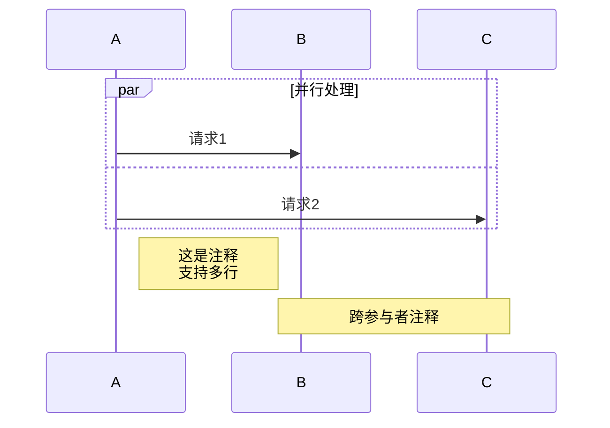
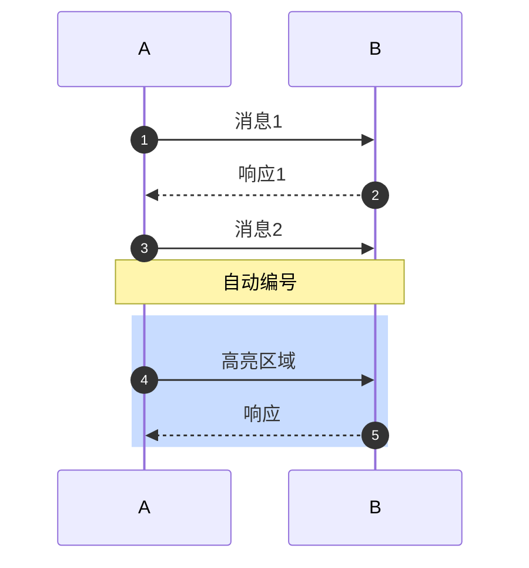

> [!info]
> 我来为你详细讲解 Mermaid 序列图的语法，包括你示例中的用法和其他重要语法。

## 📊 你的示例语法解析

**符号含义：**

- `->>` 实线箭头（同步消息）
- `-->>` 虚线箭头（异步消息）
- `+` 激活会话开始（目标参与者被激活）
- `-` 激活会话结束
- `:` 后面的文字是消息内容

## 📝 完整语法详解

### 1. **基础结构**

### 2. **参与者定义**

### 3. **消息类型**

### 4. **激活框（生命线激活）**

### 5. **循环与判断**

### 6. **并行处理和注释**

### 7. **消息序号和颜色**

