## 📋 **基础启用**
Mermaid 是 Obsidian 的**核心插件**，无需安装：
1. 打开 **设置 → 核心插件**
2. 找到 **"绘图"**（或 "Mermaid"）并启用
3. 在笔记中创建代码块：````mermaid````

## 🔤 **基础语法结构**

### 1. **基本流程图**
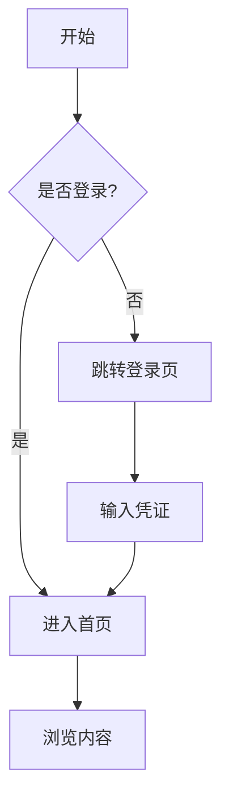

**代码：**
````

````

### 2. **方向控制**
| 方向代码 | 含义 | 英文 |
|---------|------|------|
| `TD` 或 `TB` | 从上到下 | Top to Bottom |
| `BT` | 从下到上 | Bottom to Top |
| `RL` | 从右到左 | Right to Left |
| `LR` | 从左到右 | Left to Right |

## 🎨 **节点样式详解**

### **节点形状**


**代码：**
````
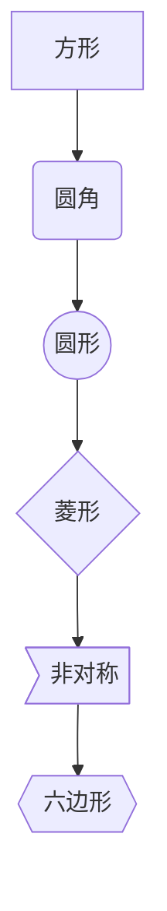
````

### 自定义节点
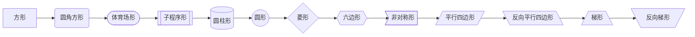

## 🔗 **连接线样式**

### **基础连接**
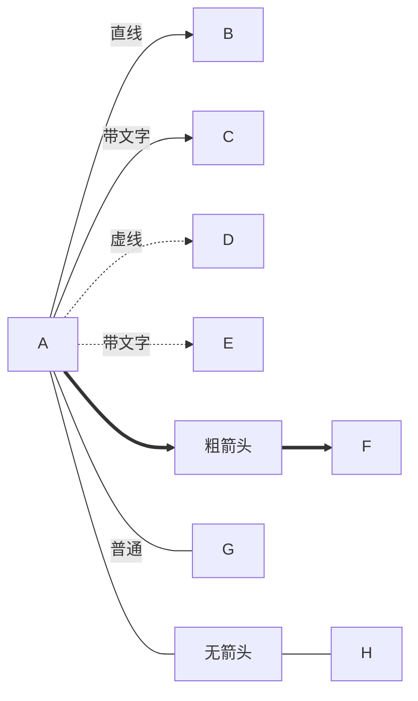

### **连接线长度**
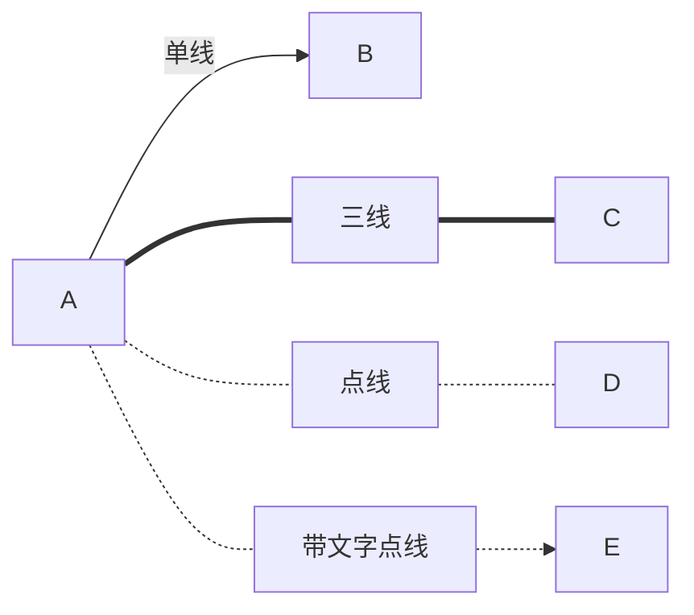

## 🏷️ **文本和样式**

### **1. 节点内换行**
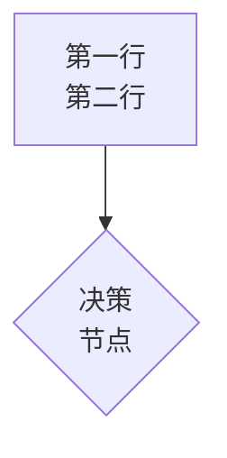

### **2. 使用HTML标签**
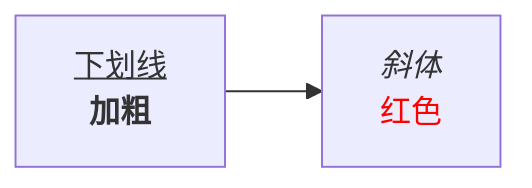

## 🎨 **样式美化**

### **1. 类定义**
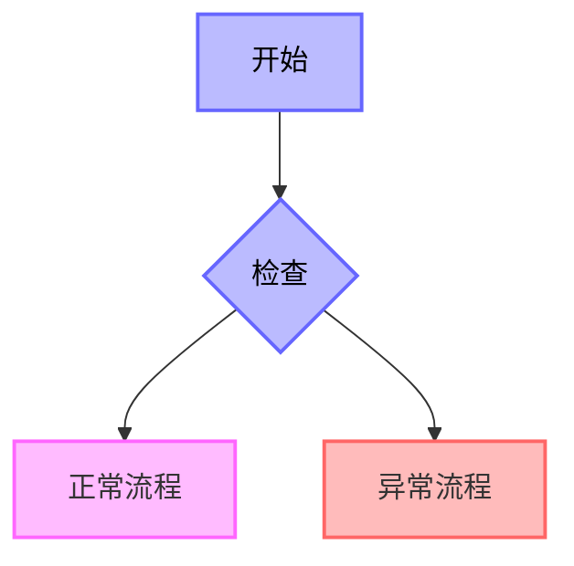

### **2. 直接样式**
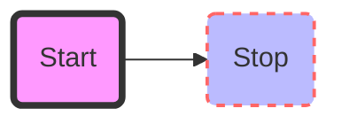

## 🔄 **子图和分组**

### **子图示例**
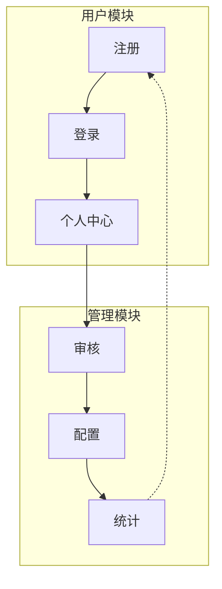

## 📊 **复杂流程图示例**

### **登录流程**
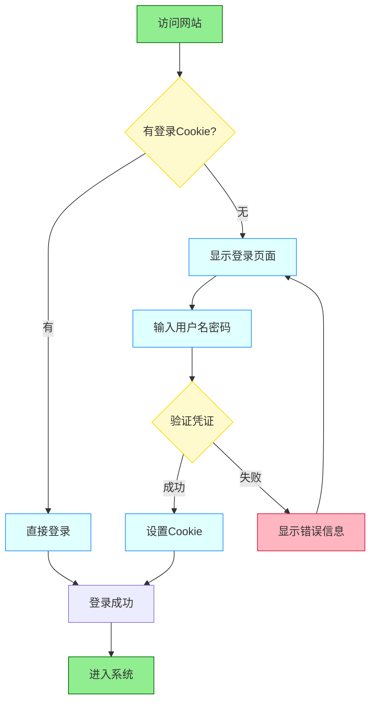

## ⚡ **实用技巧**

### **1. 注释使用**
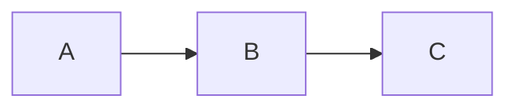

### **2. 链接功能**
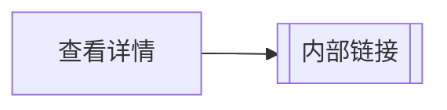

### **3. 多行代码美化**
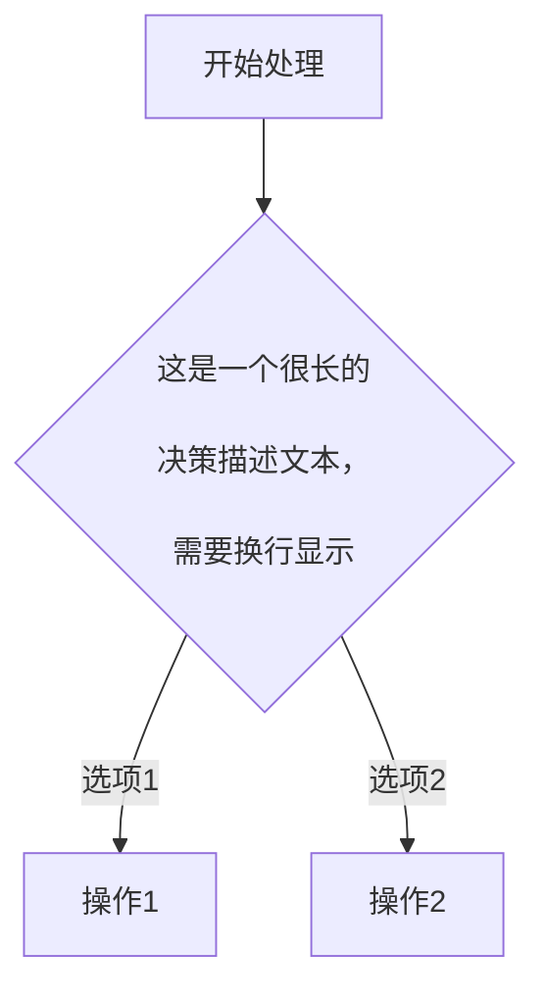

## 🚀 **高级功能**

### **时序图结合**
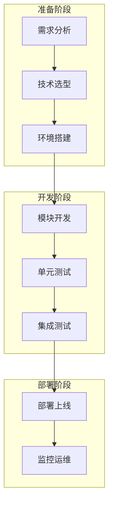

## 💡 **最佳实践建议**

1. **命名规范**：使用有意义的节点ID，如 `login_start`、`check_auth`
2. **保持简洁**：一个流程图不要超过15个节点
3. **颜色编码**：用颜色区分不同类型节点
4. **方向一致**：尽量使用 `TD`（从上到下）或 `LR`（从左到右）
5. **注释说明**：复杂逻辑添加注释

## 🔧 **问题排查**

常见问题：
- **不显示图表**：检查是否启用了Mermaid核心插件
- **语法错误**：注意缩进和符号（特别是空格）
- **样式无效**：确认类名是否正确应用

Obsidian的Mermaid支持实时预览，边写边看效果，非常方便！