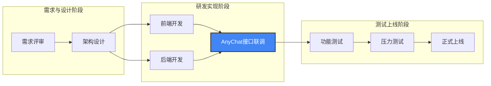
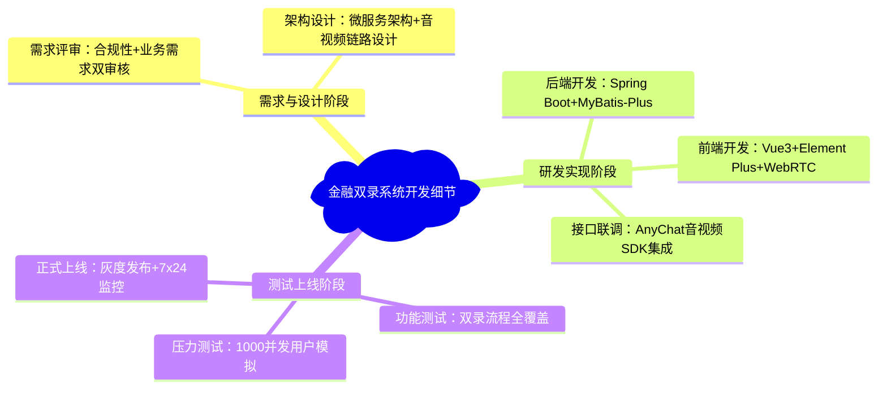

> [!info]
> 以下代码中，**流程图的每个阶段节点，都能在思维导图中找到对应的技术 / 工作细节**，形成 “流程步骤→细节支撑” 的强关联，这才是 Typora 中 “流程图 + 思维导图” 联动的核心：金融双录系统开发文档

## 开发流程（Graph流程图）

##  开发流程对应细节（Mindmap 思维导图）

## 联动逻辑的核心：内容一一对应

从代码中能清晰看到**流程图的节点和思维导图的分支完全匹配**，具体对应关系如下：

| 流程图节点（Graph）                        | 思维导图分支（Mindmap）               | 联动体现                                                     |
| ------------------------------------------ | ------------------------------------- | ------------------------------------------------------------ |
| 需求评审/架构设计（需求与设计阶段）        | 需求与设计阶段→需求评审/架构设计细节  | 流程图的阶段对应思维导图的一级分支，流程图的节点对应思维导图的二级细节 |
| 前端开发/后端开发/接口联调（研发实现阶段） | 研发实现阶段→前端/后端/接口联调技术栈 | 流程图的核心开发节点，对应思维导图的技术实现细节             |
| 功能测试/压力测试/正式上线（测试上线阶段） | 测试上线阶段→测试内容/上线策略        | 流程图的上线步骤，对应思维导图的测试/上线具体要求            |
| 核心节点「接口联调」                       | 接口联调：AnyChat SDK集成             | 流程图中标红的核心节点，在思维导图中重点拆解细节             |

这种联动不是代码上的“互相调用”，而是**文档逻辑上的“流程提框架，思维导图填细节”**——读者先通过流程图快速掌握项目的整体流程框架，再通过思维导图了解每个流程节点背后的具体工作、技术栈和要求，形成“框架-细节”的完整认知。

### 为什么原示例看不出联动？

原示例的问题在于：

1. **流程图过于简略**：仅4个无分组的节点，没有阶段划分，无法和思维导图形成层级对应；
2. **思维导图缺失**：原示例只写了流程图，未补充对应的细节分支，自然无关联；
3. **无内容对应**：流程图的节点（需求评审、架构设计）没有在思维导图中拆解细节，只是形式上放了两个图表。

###  Typora 中联动的设计技巧

1. **层级对应**：流程图用`subgraph`划分“阶段”（如需求与设计、研发实现），思维导图也用相同的“阶段”作为一级分支，形成视觉和逻辑的统一；
2. **节点对应**：流程图的每个核心节点（如接口联调），在思维导图中都要补充对应的细节（如技术栈、具体工作）；
3. **重点呼应**：流程图中用`style`标红的核心节点，在思维导图中可通过加粗/Emoji突出对应的细节分支，强化关联。

简单来说，**联动的本质是“流程图搭骨架，思维导图填血肉”**，而非两个独立图表的简单拼接，这也是在 Typora 中用 Mermaid 提升文档完整性的核心思路。