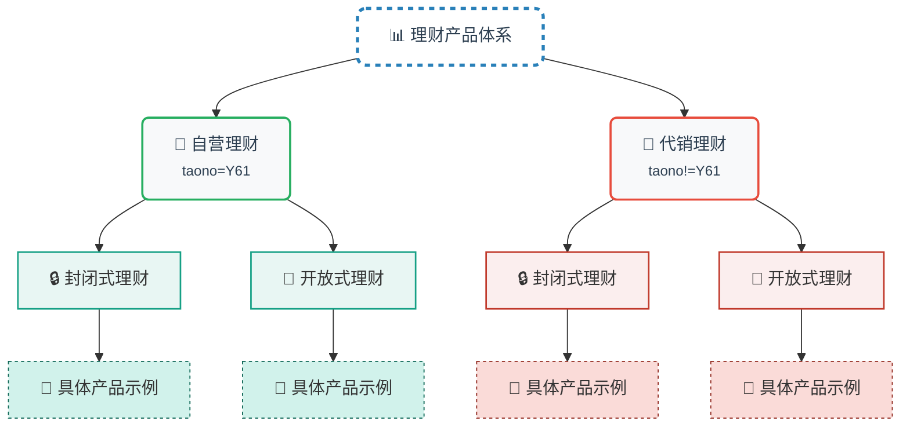
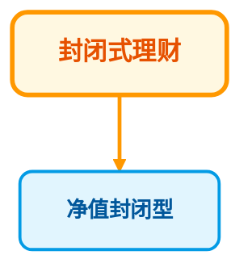
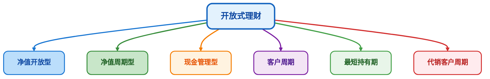
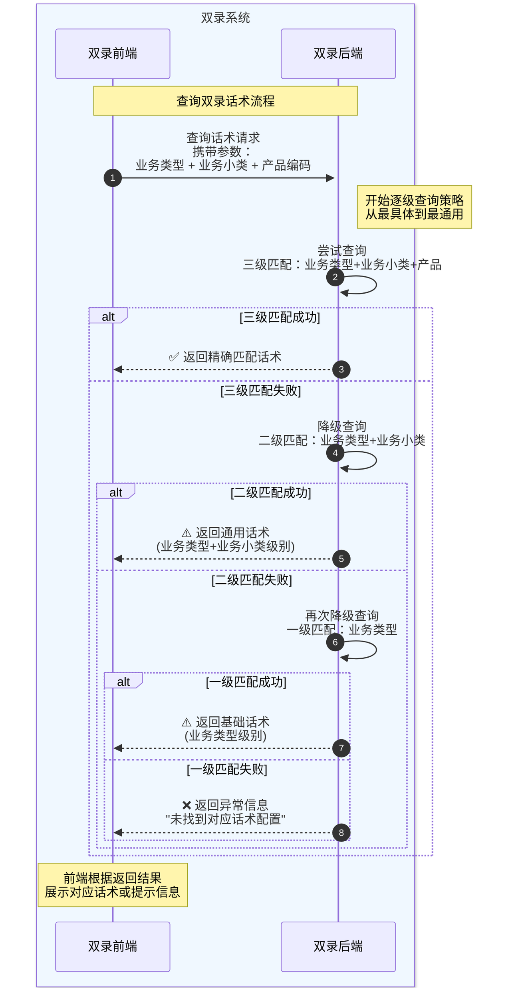
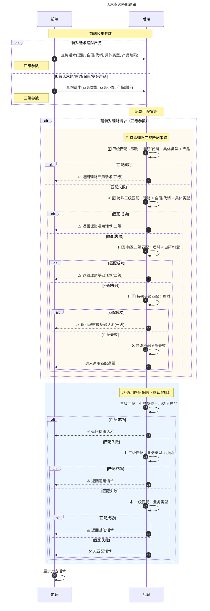

## 需求理解

> 在双录系统中增加理财产品子类型，理财产品按发行人区分自营理财和代销理财两大类，自营理财下区分封闭式理财和开放式理财，代销理财下区分封闭式理财和开放式理财.烦请科技部加急支持!

### 双录系统理财业务新增类型分类

需要在已有的产品子类型中，新增自营、代销理财，这两种类型的却分可以通过理财同步产品接口的新增字段：tanzo 来处理。字段 taono = Y61 为自营理财，不等于的代销理财。

<span style="color:#FF0000;">注意点：双录系统理财增加业务类型的需求，需要把理财系统的也带上，同步产品的接口需要他们加一个tano字段，来区分代销和自营。</span>

理财新增产品类型整体框架图：



### 封闭式理财的子业务类型

跟业务进行沟通，封闭式理财只有净值封闭型一个子业务类型。



### 开放式理财的子业务类型

开放式理财的子业务类型有：

1. 净值开放型。
2. 净值周期型。
3. 现金管理型。
4. 客户周期。
5. 最短周期。
6. 代销客户周期。



## 方案设计

> 设计的内容包含前端、后端以及数据库的全流程设计。

### 前端

前端改造的内容范围是设计到产品类型的地方，都需要调整。需要整改的菜单如下：

1. 业务配置 → 产品信息展示
2. 话术列表

#### 业务配置-产品话术配置

1. 当用户在查询参数列选择的业务类型为理财，业务子类型是新增的自营或者代销时，需要动态的在话术列表展示对应的小类信息，对应的业务类型的话术同步展示。

2. 话术新增/编辑时，产品的话术配置也需要按照这个维度来配置：理财--> 自研/代销（大类）--> 对应的小类--> 产品，四个维度来配置话术。

#### 话术列表

1. 当用户在产品的查询参数列表选择的产品子类型是自营或者代销大类时，需要动态展示自营或者代销的小类。
2. 话术列表页面需要根据所选的产品类型，动态的展示产品业务类型的大类、小类消息，话术列表也需要同步展示对应的业务类型的话术。

### 后端

> 后端服务、数据库的改造点主要围绕理财新增的大类、小类展开，涉及到的服务有双录系统产品相关服务、业务类型以及话术相关的服务的调整优化。

#### 话术逻辑的优化

双录的流程，是以产品配置的话术驱动的，目前话术的配置根据业务类型（LC、JJ、BX）-> 业务子类型-> 具体的产品。现在的需求，需要调整成：LC-> 业务大类-> 业务小类-> 具体的理财产品。

后面理财相当于配 4 个新增小类的话术就可以了，不需要配置具体的产品话术。但原有的逻辑需要兼容，已有的功能不受影响。

##### 需要优化的接口

需要对后端规则模块的功能进行优化调整，涉及到的服务如下：

* 添加质检规则
* 查询质检规则列表
* 修改质检规则
* 添加质检路由
* 修改质检路由
* 修改质检路由状态
* 查询质检路由列表
* 查询质检路由
* 查询标签质检请求

##### 优化话术接口详情

| 接口名           | 请求接口路径              | 调用方式 | 系统交互关系       |
| :--------------- | :------------------------ | :------- | :----------------- |
| 添加质检规则     | /addrule_request          | POST     | 双录前端 → 双录后端 |
| 查询质检规则列表 | /queryrule_request        | POST     | 双录前端 → 双录后端 |
| 修改质检规则     | /updaterule_request       | POST     | 双录前端 → 双录后端 |
| 添加质检路由     | /addroute_request         | POST     | 双录前端 → 双录后端 |
| 修改质检路由     | /updateroute_request      | POST     | 双录前端 → 双录后端 |
| 修改质检路由状态 | /udpateroutestate_request | POST     | 双录前端 → 双录后端 |
| 查询质检路由列表 | /queryroute_request       | POST     | 双录前端 → 双录后端 |
| 查询质检路由     | /selsingleroute_request   | POST     | 双录前端 → 双录后端 |
| 查询标签质检请求 | /recoredvideotag_request  | POST     | 双录前端 → 双录后端 |

##### 话术交互逻辑图

双录系统的双录是以配置的话术驱动的，查询话术作为双录的核心逻辑之一，为了给用户带来良好的业务体验，逻辑上的处理会稍微复杂。

###### 现有的话术查询逻辑



###### 改造后的话术查询逻辑



#### 业务大类、小类的配置

* 需要提供查询理财自营、代销大类的数据接口，供前端调用展示。
* 需要提供查询理财大类相对应的业务小类的数据接口，供前端调用展示。

##### 配置详情

具体值示例：

```yaml
# 一级分类
LC_PRODUCT_OPERATION_CATEGORY:
  "CLOSED": "封闭式理财"
  "OPEN": "开放式理财"

# 二级分类 - 分别存储
LC_CLOSED_PRODUCT_TYPES:
  "CLOSED_01": "净值封闭型"

LC_OPEN_PRODUCT_TYPES:
  "OPEN_01": "净值开放型"
  "OPEN_02": "净值周期型"
  "OPEN_03": "现金管理型"
  "OPEN_04": "客户周期型"
  "OPEN_05": "最短持有期型"
  "OPEN_06": "代销客户周期型"
```

##### 查询接口详情

后端具体接口示例：

| 接口名           | 请求接口路径         | 调用方式 | 系统交互关系       |
| :--------------- | :------------------- | :------- | :----------------- |
| 获取数据字典数据 | /qualityDict/allList | POST     | 双录前端 → 双录后端 |

#### 产品相关接口的优化

前端调用产品的相关服务都需要进行优化，因为现有的产品只有一层类型类型，现需要对理财的业务类型进行拆分。

##### 需要优化的接口

产品接口的优化，主要围绕理财新增的大类、小类进行，需要优化的接口如下：

* 根据产品代码获取产品信息
* 校验当前业务类型是否配置话术
* 校验当前业务类型是否配置话术-用户流水主流程是否可以进行下去
* 校验当前产品是否有话术

##### 接口详情

具体的接口详情信息如下：

| 接口名                         | 请求接口路径                 | 调用方式 | 系统交互关系       |
| :----------------------------- | :--------------------------- | :------- | :----------------- |
| 根据产品代码获取产品信息       | /getProductBankByProductCode | POST     | 双录前端 → 双录后端 |
| 校验当前业务类型是否配置话术   | /checkQaulityRoute           | POST     | 双录前端 → 双录后端 |
| 校验业务主流程是否可以进行下去 | /checkQualityRouteForTrade   | POST     | 双录前端 → 双录后端 |
| 校验当前产品是否有话术         | /checkProductAndRoute        | POST     | 双录前端 → 双录后端 |

#### 定时任务处理

> 由于理财系统的业务大类（自研、代销）是通过 taono = Y61 来区分的，目前双录系统同步产品的接口并没有这个字段，需要理财系统在接口上新增，然后双录系统这边进行改造。

##### 接口详情

* 交易码：200341
* 服务名称：理财产品信息查询（30053000003）
* 场景名称：双录系统产品查询（16）

### 数据库

* 数据库需要配置理财大类、小类的数据字典。
* 数据库脚本的增加

## 工时规划

> 工时清单分为两部分：前端、后端的。前端主要涉及到 2 个菜单的改造，后端需要改造话术、理财业务大类小类的配置、产品相关接口的优化、定时任务的处理以及数据库的脚本输出。

### 工时清单

| 分类                   | 功能描述                                                     | 开发工时 | 开发责任人    | 完成时间 |
| :--------------------- | ------------------------------------------------------------ | -------- | ------------- | -------- |
| 业务配置               | 理财的产品，可以大类、小类配置话术、 <br>以及话术列表页面可以查询到配置的话术 | 3        | 杨坤          | T+3      |
| 话术列表               | 可以在查询参数列根据理财的大类、小类<br>查询数据，列表对应展示话术 | 3        | 杨坤          | T+6      |
| 话术新增               | 可以根据选择的理财的大类、小类来配置话术                     | 2        | 杨坤          | T+8      |
| 话术接口优化           | 优化话术的逻辑，实现理财大类、小类话术的查<br>具体优化接口见：《2.2.1.2 优化话术接口详情》 | 6        | 周明佳        | T+14     |
| 业务大类、<br>小类配置 | 根据业务的需求，提供后端的查询接口，<br>配合前端完成页面的展示。 | 1        | 周明佳        | T+15     |
| 产品接口优化           | 根据理财业务的大类、小类，完成后端<br>相关接口的优化         | 3        | 周明佳        | T+18     |
| 定时任务处理           | 根据理财新增的字段，完成双录系统这边<br>后端的逻辑开发       | 1        | 周明佳        | T+19     |
| 数据库脚本             | 完成数据库脚本的输出，并验证。                               | 1        | 周明佳        | T+20     |
| 需求联调               | 前后端需求的整体联调+bug的解决                               | 5        | 周明<br>杨坤  | T+25     |
| 测试+业务支持          | 支持测试、业务对需求的验证，解决系统中的问题                 | 5        | 周明<br/>杨坤 | T+30     |
