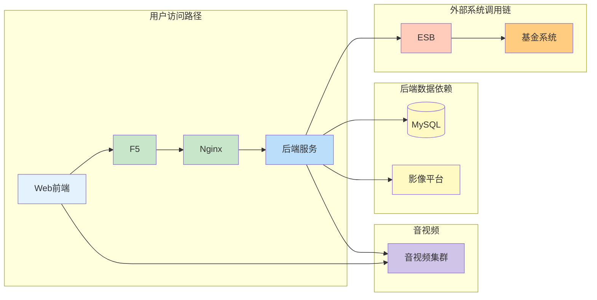
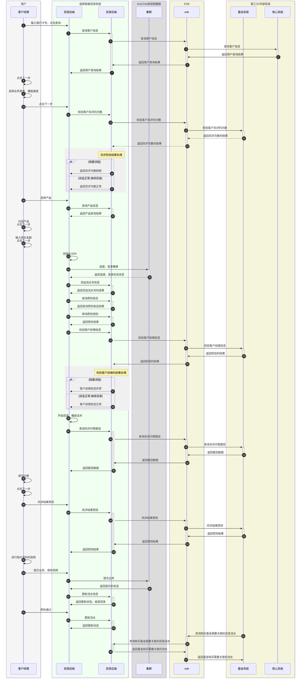

#                   基金业务双录流程技术方案

## 需求理解

> **需求描述：** 为完善理财专区内销售行为的合规性,现申请在智能双录系统中新增基金风险评估双录和基金购买双录业务流程。

**涉及功能点：**

* 功能点1：智能双录系统中新增基金风险评估双录

* 功能点2：智能双录系统种新增基金购买双录

## 方案设计

### 整体架构设计

> 说明：
>
> 1. 与基金系统的接口交互，通过esb进行。
> 2. 基金双录的视频文件，通过音视频集群上传到音像平台。
> 3. 流水数据通过双录系统的后端服务保存到mysql数据库。



### 详细架构设计

> 详细展示了客户经理从开始输入银行卡号查询用户信息，到提交双录业务，然后客户经理质检流水通过后，最后被基金系统消费、关联流水的全过程。



### 接口设计

**新增接口清单：**

| 交易名称                                               | 交互类型                                     | 调用方式                                 | 系统交互关系                                                 |
| :----------------------------------------------------- | :------------------------------------------- | :--------------------------------------- | :----------------------------------------------------------- |
| 客户购买基金产品资格校验                               | 新增接口                                     | ESB                                      | 智能双录系统 → 银保通系统                                    |
| 客户经理信息校验                                       | 新增接口                                     | ESB                                      | 智能双录系统 → 银保通系统                                    |
| <span style="color:#CC0000;">客户反洗钱信息校验</span> | <span style="color:#CC0000;">新增接口</span> | <span style="color:#CC0000;">ESB </span> | <span style="color:#CC0000;">智能双录系统 → 银保通系统</span> |
| 客户风评次数校验                                       | 新增接口                                     | ESB                                      | 智能双录系统 → 银保通系统                                    |
| 查询风险题目                                           | 新增接口                                     | ESB                                      | 智能双录系统 → 银保通系统                                    |
| 风评结果预测                                           | 新增接口                                     | ESB                                      | 智能双录系统 → 银保通系统                                    |
| 提交风险评估                                           | 新增接口                                     | ESB                                      | 智能双录系统 → 银保通系统                                    |
| 接受交易系统成功通知                                   | 修订接口                                     | ESB                                      | 银保通系统 → 智能双录系统                                    |

## 核心实现

### 关键类设计

```java
com.bairuitech.anychat.gateway
├── controller/                           # 控制器层
│   └── EsbPublicController.java
├── service/                              # 服务接口层
│   └── EsbPublicService.java
├── service/impl/                         # 服务实现层
│   └── EsbPublicServiceImpl.java
```

### 技术要点

* **异常处理：** 统一异常处理器
* **日志记录：** 关键操作记录审计日志

## 代码规范

1. **命名规范：** 遵循公司命名规范
2. **注释要求：** 复杂逻辑需添加注释
3. **日志规范：** 使用LOG4J，关键操作记录INFO日志
4. **异常处理：** 使用自定义业务异常
