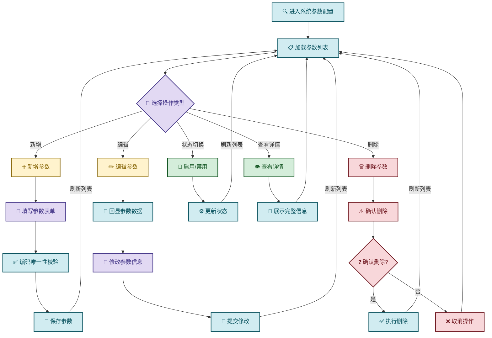
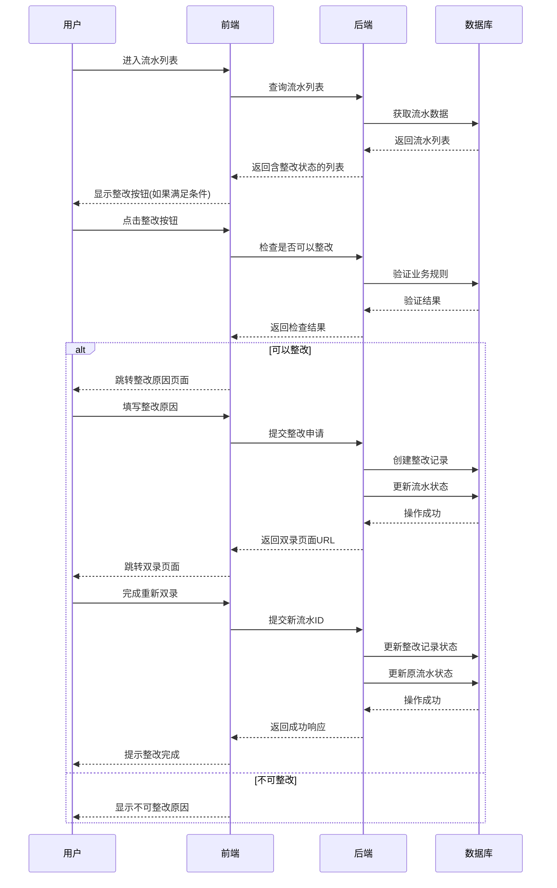
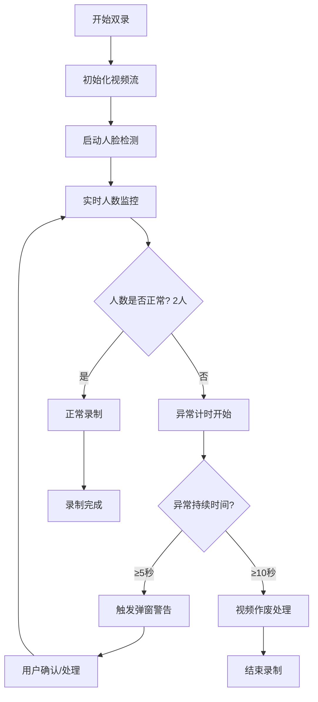
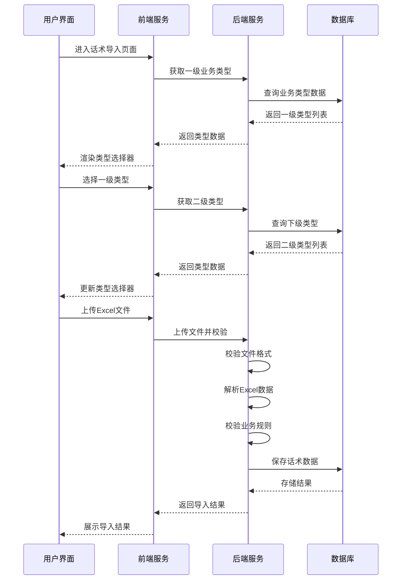

> PR20250110-010_XQ-20240929-10 零售金融部关于录音录像系统优化的需求
## 增加"启用条件变量"
> [!info]
> 增加"启用条件变量"功能，当客户年龄达到65岁，在双录流程发起后进行二次提醒具体提醒内容及年龄可配置;

### 一、功能需求
1. 新增"系统参数配置"一级菜单
2. 实现参数的增、删、改、查
3. 涉及表：qualityvariable（主表）、qualityvariableex（扩展表）

### 二、后端设计要点

#### 1. API接口
```
GET    /variables          # 查询列表
GET    /variables/{id}     # 获取详情  
POST   /variables          # 新增
PUT    /variables/{id}     # 修改
DELETE /variables/{id}     # 删除
PATCH  /variables/{id}/status  # 启用/禁用
```

#### 2. 核心逻辑
- **参数编码**：唯一性校验
- **系统参数**：标识为系统参数的记录不允许删除
- **扩展信息**：支持动态扩展属性
- **事务管理**：主表和扩展表操作保持一致性

#### 3. 主要类
- `VariableController` - 控制器
- `VariableService` - 业务服务
- `Variable` / `VariableEx` - 实体类
- `VariableDTO` - 数据传输对象

### 三、前端设计要点

#### 1. 页面结构
```
参数管理页
├── 查询条件（编码、名称、分类）
├── 操作按钮（新增、删除、导出）
├── 参数表格
│   ├── 基本列：编码、名称、值、状态
│   └── 操作列：编辑、删除、详情
└── 表单弹窗（新增/编辑）
```

#### 2. 组件划分
- `VariableList.vue` - 列表页面
- `VariableForm.vue` - 表单组件
- `VariableDetail.vue` - 详情组件

#### 3. 关键流程
- **新增**：填写表单 → 保存 → 刷新列表
- **编辑**：点击编辑 → 回显数据 → 保存 → 刷新
- **删除**：确认提示 → 删除 → 刷新


### 四、数据库关键字段

#### qualityvariable（主表）
- `code` - 参数编码（唯一）
- `codename` - 参数名称
- `type` - 参数类型
- `appid` - 应用id
- `enable` - 状态（启用/禁用）
- `createtime`-创建时间

#### qualityvariableex（扩展表）
- `id` - 主表ID
- `variableid` - 扩展键
- `variablevalue` - 扩展值
- `variablevaluename`-变量名称

---
## 理财标准财富双录整改
> [!info]
> 增加理财业务标准财富双录整改功能，在财富双录整改界面分为理财和保险，保险沿用之前的整改方式，理财业务定位到待整改的双录流水、填写整改原因后可新建双录视频，且该视频仍在原先业务关联的流水号内，并保存整改的相关记录;
### 一、功能需求
1. 理财标准财富双录流水，质检通过后，可以在流水管理页面进行整改。
2. 前端流水列表需要对理财质检通过的流水做判断，如果满足条件，就把整改的按钮放开。
3. 点击整改，填写整改原因，然后进入双录页面进行双录的流程。
4. 整改完后，需要再次进行质检，如果质检通过，则流程终止，否则再次进行整改的操作。

### 二、整改限制
* 只有质检通过的流水才能整改
* 同一流水整改次数无限制
* 整改中的流水不能再次整改
### 三、整改流程页面
#### 3.1 整改原因填写页
* 必填项：整改原因（文本域）
* 字数限制：500字内
* 提交后跳转双录页面
### 四、完整流程时序图


## 在框人数校验
> [!info]
> 双录过程中，只允许有两人的存在，如有第三人出现在视频内停留时间达到5秒或有人离开视频导致视频内不到两人的情况达到5秒，进行弹窗警告提示，当上诉情况超10秒此视频作废处理。

### 一、整体架构设计
#### 1.1 监控流程概览

#### 1.2 技术选型
* 计时器：Web Workers（避免主线程阻塞）

## 双录话术导入
> [!info]
> 新增话术一键上传的功能，通过系统下载话术模板（可一条、可多条），将需使用的话术编辑好后可一键上传至系统中使用

### 一、功能概述
#### 1.1 业务目标
提供话术模板的Excel批量导入功能，支持多级业务类型筛选后按模板导入话术数据。
#### 1.2 核心流程
```text
用户选择三级业务类型 → 上传Excel文件 → 格式校验 → 数据解析 → 数据存储 → 展示结果
```
### 二、系统架构设计
#### 2.1 前后端交互时序

#### 2.2 模块划分
```text
话术导入模块
├── 前端模块
│   ├── 业务类型选择组件
│   ├── 文件上传组件
│   └── 结果展示组件
├── 后端服务
│   ├── 业务类型查询服务
│   ├── 文件校验服务
│   ├── Excel解析服务
│   └── 数据存储服务
└── 公共组件
    ├── 异常处理机制
    └── 日志记录模块
```

### 三、接口设计
#### 3.2 话术导入接口
##### 3.2.1 文件上传接口
```text
POST /api/script/import
参数：
- businessTypeId: 三级业务类型ID
- file: Excel文件
```

### 四、业务规则设计
#### 5.1 文件校验规则
1. **格式限制**：仅支持.xlsx和.xls格式
2. **大小限制**：单文件不超过10MB
3. **模板验证**：检查Excel表头是否符合模板要求
#### 5.2 数据校验规则
1. **必填字段检查**：话术内容、话术类型等必填项
2. **格式校验**：内容长度、特殊字符等
3. **业务逻辑校验**：话术类型是否在允许范围内
4. **重复性检查**：避免重复导入相同话术
#### 5.3 导入策略
1. **异步处理**：大文件导入采用异步处理
2. **批量插入**：使用批量插入提高性能
3. **事务控制**：保证数据一致性
4. **失败重试**：支持部分失败重新导入

- ! demo示例：[[Excel导入后端代码Demo]]
