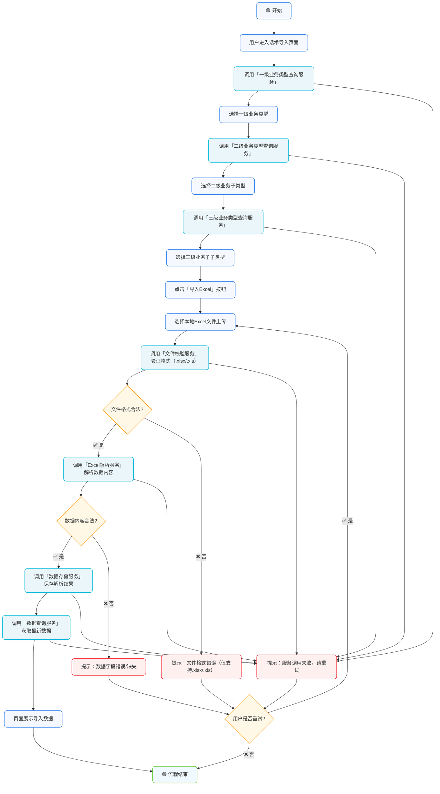

```mermaid
flowchart TD
    %% 样式优化：更柔和的配色+统一圆角
    classDef userOp fill:#f5f9ff,stroke:#2f80ed,stroke-width:1.5px,rx:8,ry:8;
    classDef service fill:#eaf6fa,stroke:#00b8d9,stroke-width:1.5px,rx:8,ry:8;
    classDef decision fill:#fff8e6,stroke:#ff9800,stroke-width:1.5px,rx:8,ry:8;
    classDef exception fill:#fff0f0,stroke:#f5222d,stroke-width:1.5px,rx:8,ry:8;
    classDef endNode fill:#f0f9ff,stroke:#52c41a,stroke-width:1.5px,rx:8,ry:8;

    %% 开始 + 业务类型选择（左侧主流程）
    A[🟢 开始]:::userOp --> B[用户进入话术导入页面]:::userOp
    B --> S0[调用「一级业务类型查询服务」]:::service
    S0 --> C1[选择一级业务类型]:::userOp
    C1 --> S1[调用「二级业务类型查询服务」]:::service
    S1 --> C2[选择二级业务子类型]:::userOp
    C2 --> S2[调用「三级业务类型查询服务」]:::service
    S2 --> C3[选择三级业务子子类型]:::userOp

    %% Excel导入 + 校验（中间主流程）
    C3 --> U1[点击「导入Excel」按钮]:::userOp
    U1 --> U2[选择本地Excel文件上传]:::userOp
    U2 --> S3[调用「文件校验服务」<br/>验证格式（.xlsx/.xls）]:::service
    S3 --> D1{文件格式合法?}:::decision
    
    %% 正常分支（右侧主流程）
    D1 -->|✅ 是| S4[调用「Excel解析服务」<br/>解析数据内容]:::service
    S4 --> D2{数据内容合法?}:::decision
    D2 -->|✅ 是| S5[调用「数据存储服务」<br/>保存解析结果]:::service
    S5 --> S6[调用「数据查询服务」<br/>获取最新数据]:::service
    S6 --> U3[页面展示导入数据]:::userOp
    U3 --> E[🟢 流程结束]:::endNode

    %% 异常分支（统一归类到下方，避免交叉）
    D1 -->|❌ 否| E1[提示：文件格式错误（仅支持.xlsx/.xls）]:::exception
    D2 -->|❌ 否| E2[提示：数据字段错误/缺失]:::exception
    %% 通用服务异常（所有服务节点失败都指向这里）
    S0 & S1 & S2 & S3 & S4 & S5 & S6 --> E3[提示：服务调用失败，请重试]:::exception

    %% 异常重试逻辑（统一汇总）
    E1 & E2 & E3 --> D3{用户是否重试?}:::decision
    D3 -->|✅ 是| U2
    D3 -->|❌ 否| E
```

1. ai能力希望能用v3的集群ai能力。
2. 需求4：三个人在框5s的逻辑，跟业务确认。
3. 人脸比对、实时质检引擎的升级。

ai能力的需求最好做到信创里面去，这样更方便实施。